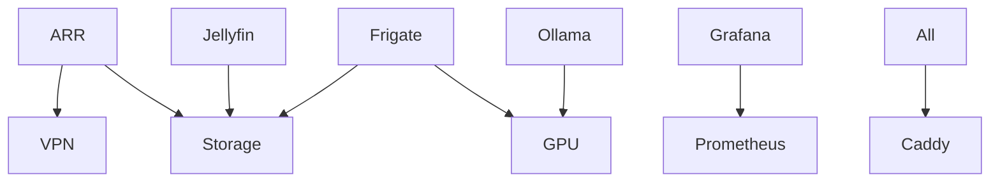

# Service Catalog

## Media Services

### Jellyfin
- **Module**: `modules/services/jellyfin.nix`
- **Port**: 8096
- **GPU**: Optional
- **Storage**: Media tier
- **Profile**: media

### ARR Stack
- **Sonarr**: Port 8989 (TV)
- **Radarr**: Port 7878 (Movies)
- **Prowlarr**: Port 9696 (Indexers)
- **Bazarr**: Port 6767 (Subtitles)

## Monitoring

### Prometheus
- **Module**: `modules/services/prometheus.nix`
- **Port**: 9090
- **Retention**: 90 days
- **Profile**: monitoring

### Grafana
- **Module**: `modules/services/grafana.nix`
- **Port**: 3000
- **Dashboards**: Auto-provisioned
- **Profile**: monitoring

## AI/ML Services

### Ollama
- **Module**: `modules/services/ollama.nix`
- **Port**: 11434
- **GPU**: Required
- **Models**: llama2, codellama, mistral
- **Profile**: ai

### AI Bible System
- **Module**: `modules/services/ai-bible.nix`
- **Port**: 8888
- **Features**: Auto-generation, LLM integration
- **Profile**: ai

## Infrastructure

### Caddy
- **Module**: `modules/services/caddy.nix`
- **Ports**: 80, 443
- **Auto-HTTPS**: Yes
- **Profile**: base

### Databases
- **PostgreSQL**: Port 5432
- **Redis**: Port 6379
- **InfluxDB**: Port 8086

## Security

### Tailscale
- **Module**: `modules/services/vpn.nix`
- **Zero-trust**: Yes
- **Exit node**: Optional
- **Profile**: security

### Frigate
- **Module**: `modules/services/frigate.nix`
- **Port**: 5000
- **RTSP**: 8554
- **GPU**: Recommended
- **Storage**: Hot tier

## Service Dependencies

